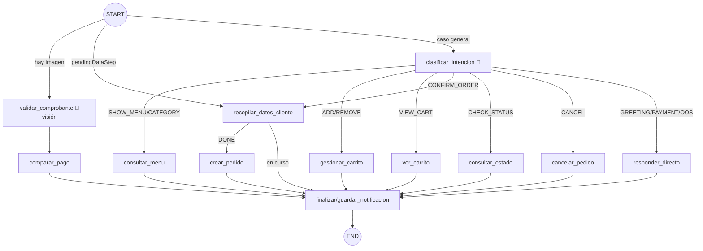
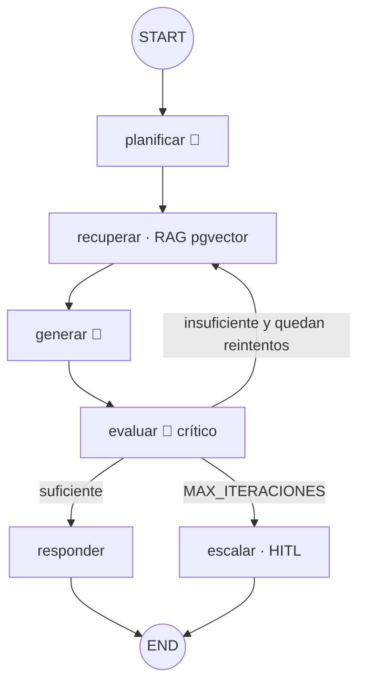

# El Trujillano Delivery — Multiagente con LangGraph + API de Claude

Sistema de delivery automatizado para el restaurante **El Trujillano** (Trujillo, Perú).
La orquestación es un **grafo de estados de LangGraph**; el ciclo de pedido completo y un
**agente de reclamos basado en el patrón Deep Agent** conviven sobre el mismo stack.

> **Principio de diseño innegociable:** un componente solo es "agente" (usa chat model) si
> el LLM debe **razonar, clasificar o interpretar lenguaje/imágenes**. SQL, sumas,
> validaciones con `if` y CRUD son **nodos deterministas o tools**, NO agentes.

---

## 1. ¿Qué es agente y qué es determinista? (y POR QUÉ)

### El orquestador ES el grafo
No existe ninguna clase `OrchestratorAgent`. La máquina de estados del pedido es un
`StateGraph` (`el_trujillano/graphs/ventas_graph.py`): el grafo mantiene el estado, decide
transiciones con aristas condicionales y delega en los nodos.

### Nodos CON chat model (agentes reales)

| Componente | ¿Por qué ES agente? |
|---|---|
| `clasificar_intencion` | El LLM debe **interpretar lenguaje natural ambiguo** del cliente y mapearlo a una intención. Devuelve salida estructurada (`IntencionClasificada`). |
| `validar_comprobante` | Modelo con **visión**: lee la imagen del comprobante Yape/Plin y **extrae** monto, método, número (aunque esté enmascarado `*** *** 977`) y nombre. Salida estructurada (`ComprobanteExtraido`). |
| Deep Agent: `planificar` | **Razona** para descomponer el reclamo (qué pasó / qué pide / qué política aplica). Salida estructurada (`PlanReclamo`). |
| Deep Agent: `generar` | **Redacta** la propuesta de solución apoyada solo en la política recuperada. |
| Deep Agent: `evaluar` | Sub-agente **crítico**: juzga si la propuesta tiene respaldo real. Salida estructurada (`VeredictoReclamo`). |

### Nodos DETERMINISTAS / tools (sin LLM)

| Componente | ¿Por qué NO es agente? |
|---|---|
| `consultar_menu` | RAG semántico + **SQL** sobre el catálogo. Arma texto fijo. |
| `gestionar_carrito` | Agrega/quita ítems: matching + **aritmética**. |
| `recopilar_datos_cliente` | Máquina de pasos `NAME→PHONE→ADDRESS→REFERENCE→CONFIRMING` con validaciones (`if`, teléfono = 9 dígitos). |
| `crear_pedido` | **CRUD**: persiste el pedido en `PAGO_PENDIENTE`. |
| `comparar_pago` | Compara extraído vs pedido: monto (±S/0.10), número, nombre. **Comparaciones**, no razonamiento. |
| `validar_estado_cocina` | **REGLA CRÍTICA**: un `if` que rechaza todo pedido que no esté en `PAGO_VALIDADO`. |
| `asignar_repartidor` | Primer repartidor disponible en **transacción atómica** (`SELECT ... FOR UPDATE SKIP LOCKED`). |
| `guardar_notificacion` | **CRUD** de notificaciones por canal. |
| `cerrar_pedido` | Cierra el pedido + crea encuesta vacía + libera repartidor. |
| `recuperar` (Deep Agent) | **RAG** sobre el PDF de políticas (pgvector). |

> La **"negociación" no es un agente aparte**: es la fase `generar ↔ evaluar` dentro del
> mismo Deep Agent.

---

## 2. Grafo de ventas



### Máquina de estados del pedido (back-office: `order_flow.py`)

```
PAGO_PENDIENTE → PAGO_ENVIADO → PAGO_VALIDADO  (o PAGO_RECHAZADO → reenvío)
PAGO_VALIDADO → EN_COCINA          (← validar_estado_cocina, REGLA CRÍTICA)
EN_COCINA → LISTO_PARA_REPARTO → EN_REPARTO → ENTREGADO → CERRADO
```

---

## 3. Deep Agent de reclamos



- **Memoria en el estado:** `historial` (consultas intentadas) e `iteraciones`.
- **Límite operativo:** `MAX_ITERACIONES_RECLAMO = 3`.
- **HITL:** si no resuelve, deriva a un humano.

---

## 4. Stack

- Python 3.11+ (probado el compilado en 3.10; se recomienda 3.11)
- **LangGraph** (`StateGraph`) — orquestación
- **LangChain** — tools, RAG, salida estructurada
- **API de Claude (Anthropic)** vía `langchain-anthropic` (`ChatAnthropic`), modelo
  `claude-haiku-4-5-20251001` por defecto, con **visión nativa** para los comprobantes
- **Embeddings** vía Voyage AI (`langchain-voyageai`) o HuggingFace (Claude no ofrece
  embeddings propios)
- **PostgreSQL 15 + pgvector** (vector store) y SQLAlchemy (relacional)
- **LangSmith** (observabilidad) · **FastAPI** (REST) con **auth JWT + roles**
- **Frontend React + Vite + TailwindCSS** (chatbot + paneles admin/cocina/repartidor)

> **Un solo backend.** El frontend React (heredado) consume EXCLUSIVAMENTE esta API
> FastAPI bajo `/api`. El antiguo backend Node fue reemplazado. La capa
> `el_trujillano/api/serializers.py` adapta los modelos internos (en español) a la
> forma que el frontend espera (campos Prisma en inglés, `id` como string).

---

## 5. Cómo correr

### Requisitos previos
- PostgreSQL 15 con permiso para `CREATE EXTENSION vector` (paquete `pgvector` instalado).
- Una API key de Claude (`ANTHROPIC_API_KEY`).
- Node.js 18+ (para el frontend).

### Backend

```bash
# 1) Entorno
python -m venv .venv && .venv\Scripts\activate     # Windows
pip install -r requirements.txt

# 2) Configuración
copy .env.example .env        # y completa las claves

# 3) Base de datos: extensión pgvector + tablas + seed (productos, repartidores y USUARIOS)
python -m scripts.seed_catalog

# 4) Ingesta RAG (catálogo + PDF de políticas; genera el PDF de ejemplo)
python -m scripts.run_ingest

# 5) Levantar la API (puerto 8000)
uvicorn el_trujillano.api.main:app --reload --port 8000
#    (o probar el chat por consola:  python -m scripts.demo_cli)
```

### Frontend

```bash
cd frontend
npm install
npm run dev        # http://localhost:5173 (proxy /api -> http://localhost:8000)
```

### Credenciales del panel (seed)
| Rol | Email | Password |
|---|---|---|
| Admin | `admin@eltrujillano.com` | `admin123` |
| Cocina | `cocina@eltrujillano.com` | `cocina123` |
| Repartidor | `repartidor@eltrujillano.com` | `repartidor123` |

### Endpoints (todos bajo `/api`)
| Método | Ruta | Descripción |
|---|---|---|
| POST | `/api/auth/login` | Login JWT, devuelve `{token, user}`. |
| POST | `/api/chat/message` | Turno del chatbot (multipart, acepta `attachment`). |
| GET | `/api/chat/driver-check/{sid}` · `/survey-check/{sid}` | Polling de repartidor / encuesta. |
| GET/POST/PATCH | `/api/admin/*` | Pedidos, métricas, pagos, productos, repartidores (rol ADMIN). |
| GET/POST | `/api/kitchen/*` | Pedidos en cocina y marcar listo (roles ADMIN/COCINA). |
| GET/POST | `/api/driver/*` | Entregas activas/listas/completadas (roles ADMIN/REPARTIDOR). |
| POST | `/api/admin/orders/{id}/validate-payment` | **HITL**: aprobación/rechazo manual del pago. |
| POST | `/api/reclamos` | Deep Agent de reclamos. |

---

## 6. Persistencia, HITL y observabilidad

- **Checkpointing de LangGraph:** los grafos compilan con el checkpointer que decide
  `LANGGRAPH_CHECKPOINTER` (`memory` → `MemorySaver` para desarrollo/tests; `postgres`
  → `PostgresSaver` de `langgraph-checkpoint-postgres` sobre la MISMA PostgreSQL en
  producción). La selección vive en `graphs/checkpointer.py` y degrada a `MemorySaver`
  si Postgres no está disponible. El `thread_id` es el `session_id`, así el carrito y
  los datos del cliente persisten entre turnos.
- **Human-in-the-loop:** (a) `/admin/comprobante/{id}/...` permite aprobar/rechazar el
  pago manualmente; (b) el Deep Agent escala a humano al superar `MAX_ITERACIONES`.
- **LangSmith:** activa `LANGSMITH_TRACING=true` y define `LANGSMITH_API_KEY` /
  `LANGSMITH_PROJECT` en `.env` para trazar cada ejecución del grafo y llamada al LLM.

---

## 6.b Pruebas y evaluación (PASO 8 y 10)

### Suite de pruebas
```bash
python -m tests.test_logica_determinista   # unitarias: cálculo, teléfono, comparación de pago, regla de cocina
python -m tests.test_integracion_grafos     # integración: aristas condicionales + escalamiento del Deep Agent
python -m tests.test_e2e                     # e2e: venta completa y reclamo completo (se OMITEN sin API key/BD)
pytest tests/                                # también corren con pytest
```
- **Unitarias:** número enmascarado (`*** *** 977`), titular, y la máquina de estados del pedido.
- **Integración:** `route_entry` / `route_intencion` / `route_post_datos`, la sub-máquina
  `recopilar_datos_cliente`, y la **regla del PASO 4**: el Deep Agent escala a humano tras
  `MAX_ITERACIONES`.
- **E2E:** flujo de venta (chat → carrito → datos → `crear_pedido` → **regla crítica de cocina**)
  y flujo de reclamo (planificar → RAG → generar → evaluar → resolver/escalar). Requieren
  `ANTHROPIC_API_KEY` + PostgreSQL; si faltan, se omiten limpiamente.

### Evaluación contra golden set
```bash
python -m eval.evaluar
```
Mide las métricas de éxito del PASO 1/8 sobre `eval/golden_set.json`:

| Capacidad | Cómo se mide | Requiere |
|---|---|---|
| Validación de pago | exactitud vs casos esperados (determinista) | nada (siempre corre) |
| Clasificación de intención | precisión sobre 14 mensajes etiquetados | `ANTHROPIC_API_KEY` |
| Reclamos (Deep Agent) | % resueltos sin escalar + iteraciones promedio + latencia | API key + BD/RAG |

Tokens y latencia fina por invocación se leen en **LangSmith** (`LANGSMITH_TRACING=true`).

---

## 6.c Despliegue en Render (PASO 7)

Monolito modular: **un Web Service Python (FastAPI/uvicorn) + una PostgreSQL gestionada** con
pgvector. Todo está declarado en [`render.yaml`](./render.yaml) (blueprint).

**Opción A — Blueprint (recomendada):**
1. Sube el repo a GitHub. En Render: **New → Blueprint** y apunta al repo (usa `render.yaml`).
2. Render crea la BD `el-trujillano-db` y el servicio `el-trujillano-api` (`rootDir: delivery-langgraph`).
3. Completa en el dashboard las variables marcadas `sync: false`: `ANTHROPIC_API_KEY`,
   `VOYAGE_API_KEY`, `LANGSMITH_API_KEY` (`DATABASE_URL` y `JWT_SECRET` se inyectan/generan solos).
4. El primer deploy corre `scripts/start_render.sh`, que:
   - **build:** `pip install -r requirements.txt`;
   - **start:** crea pgvector + tablas + seed (`seed_catalog`), ejecuta la ingesta RAG una vez
     (`RUN_INGEST_ON_START=true`) y arranca `uvicorn el_trujillano.api.main:app --host 0.0.0.0 --port $PORT`.
5. Verifica en `GET /api/health`. Tras el primer arranque puedes poner `RUN_INGEST_ON_START=false`.

**Opción B — Manual:** crea una PostgreSQL en Render, habilita pgvector (`scripts/enable_pgvector.sql`
o automático), y un Web Service Python con **Build**: `pip install -r requirements.txt` y
**Start**: `bash scripts/start_render.sh` (o el `uvicorn ...` directo tras correr el seed/ingesta como job).

> Render entrega `DATABASE_URL` como `postgresql://…`; `config.py` la reescribe sola a
> `postgresql+psycopg://…` (dialecto psycopg3 que usan SQLAlchemy y `langchain-postgres`).

---

## 7. Decisiones documentadas

- **Claude para todo el razonamiento** (clasificación, visión, crítico del Deep Agent):
  un solo modelo configurable por `CLAUDE_MODEL`.
- **Embeddings externos** porque Anthropic no ofrece modelo de embeddings; por defecto
  Voyage AI, con HuggingFace como alternativa local sin costo.
- **Datos estructurados en tablas relacionales**, nunca en la base vectorial. Solo el
  catálogo (texto) y el PDF de políticas se vectorizan.
- **Comparación de número de pago por últimos dígitos** para tolerar el enmascaramiento
  de Yape/Plin (`*** *** 977`).
- **Blindaje anti prompt-injection (PASO 9):** defensa en profundidad. (1) Lo crítico ya es
  determinista — precios desde la BD, validación de pago y regla de cocina no confían en el
  LLM, y el routing usa un enum Pydantic. (2) Además, `el_trujillano/prompt_guard.py` añade a
  cada nodo-agente (`clasificar_intencion`, `planificar`, `generar`, `evaluar`) una cláusula
  de seguridad y delimita el texto del cliente/reclamo como CONTENIDO NO CONFIABLE (marcas +
  truncado por `MAX_INPUT_CHARS`/`MAX_RECLAMO_CHARS`), para que el modelo lo trate como datos
  y nunca como instrucciones. El dinero real siempre pasa por HITL.

## 8. Estructura

```
delivery-langgraph/
├── el_trujillano/               # BACKEND (Python)
│   ├── config.py            # settings desde .env (determinista)
│   ├── llm.py               # fábricas ChatAnthropic + embeddings
│   ├── prompt_guard.py      # blindaje anti prompt-injection (determinista)
│   ├── estados.py           # estados y aristas válidas del pedido
│   ├── state.py             # VentasState y ReclamoState (TypedDict)
│   ├── order_flow.py        # transiciones back-office (cocina→reparto→cierre)
│   ├── db/                  # SQLAlchemy: database, models (User, Order...), init_db
│   ├── rag/                 # vectorstore (pgvector) + ingest
│   ├── schemas/             # Pydantic: intencion, comprobante, reclamo
│   ├── nodes/               # nodos del grafo de ventas
│   ├── reclamos/            # nodos del Deep Agent
│   ├── graphs/              # ventas_graph.py + reclamos_graph.py + checkpointer.py
│   └── api/                 # FastAPI
│       ├── main.py          # app + montaje de routers bajo /api + /uploads
│       ├── security.py      # auth JWT + roles (login con bcrypt)
│       ├── serializers.py   # modelos -> forma que espera el frontend
│       └── routers/         # auth, admin, kitchen, driver, chat
├── frontend/                    # FRONTEND (React + Vite + Tailwind)
│   └── src/                 # ChatbotWidget, AdminPage, KitchenPage, DriverPage, LoginPage
├── eval/                    # golden_set.json + evaluar.py (métricas PASO 8)
├── tests/                   # unitarias, integración (grafos) y e2e
├── scripts/                 # seed, ingesta, PDF, demo CLI, start_render.sh, enable_pgvector.sql
├── data/                    # políticas (.md) y PDF generado
├── docs/                    # documentación/diagramas heredados
├── render.yaml              # blueprint de despliegue en Render
├── requirements.txt
└── .env.example
```

> **Nota de IDs:** internamente los pedidos usan `id` entero; los serializadores lo
> exponen como string porque el frontend hace `order.id.slice(-6)`. Las transiciones
> de back-office se exponen vía los routers de cocina/repartidor (cocina "marcar listo"
> intenta auto-asignar repartidor para que el flujo del demo avance solo).
