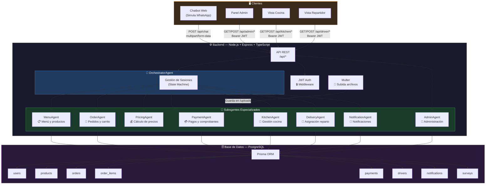

# Arquitectura del Sistema Multiagente — El Trujillano Delivery

## Diagrama de Arquitectura



## Descripción de Componentes

### OrchestratorAgent (Cerebro del sistema)
- Mantiene el estado de cada conversación en memoria (Map por sessionId)
- Implementa una máquina de estados finita
- Delega cada acción al subagente correspondiente
- **No hace trabajo directo**: coordina y delega

### Estados de la máquina de estados del chat
| Estado | Descripción |
|--------|-------------|
| GREETING | Bienvenida, solicitud de nombre |
| COLLECTING_NAME | Captura del nombre del cliente |
| MENU | Muestra el menú interactivo |
| SELECTING | El cliente selecciona productos |
| COLLECTING_PHONE | Captura teléfono del cliente |
| COLLECTING_ADDRESS | Captura dirección de entrega |
| COLLECTING_REFERENCE | Captura referencia de entrega |
| CONFIRMING_ORDER | Confirmación del pedido |
| PAYMENT_INSTRUCTIONS | Instrucciones de pago Yape/Plin |
| WAITING_PROOF | Esperando comprobante de pago |
| AWAITING_VALIDATION | Pago enviado, esperando admin |
| ORDER_ACTIVE | Pedido en proceso |
| SURVEY | Encuesta de satisfacción |

### Subagentes y sus responsabilidades

| Agente | Responsabilidad principal | Método clave |
|--------|--------------------------|--------------|
| MenuAgent | Catálogo de productos | `getFormattedMenu()`, `findProductByNameOrNumber()` |
| OrderAgent | Carrito y pedidos | `parseAndAddToCart()`, `createOrder()` |
| PricingAgent | Cálculo de precios | `calculateSubtotal()`, `generateSummary()` |
| PaymentAgent | Gestión de pagos | `saveProof()`, `validatePayment()` |
| KitchenAgent | Control de cocina | `receiveOrder()`, `markOrderReady()` |
| DeliveryAgent | Asignación y entrega | `assignDriver()`, `confirmDelivery()` |
| NotificationAgent | Mensajería interna | `saveNotification()`, `notifyStatusChange()` |
| AdminAgent | Panel administrativo | `getMetrics()`, `validatePayment()` |

## Integración con Claude AI

El sistema usa la API de Anthropic en dos puntos del flujo:

### 1. Validación de comprobantes de pago (Claude Vision)
Cuando el cliente sube una imagen del comprobante (Yape / Plin), `PaymentAgent` invoca Claude con visión para extraer y verificar:
- Monto transferido
- Número de destino (938749977 — El Trujillano)
- Método de pago
- Nivel de confianza de la validación

Esto permite al admin aprobar o rechazar con datos pre-analizados, reduciendo el tiempo de validación a menos de 3 minutos.

### 2. Detección de intención en el chatbot
La ruta `/api/chat` puede invocar Claude para interpretar mensajes ambiguos del cliente (producto no reconocido, texto libre fuera de flujo), complementando la lógica de la máquina de estados del `OrchestratorAgent`.

---

## Stack Tecnológico

```
Backend:        Node.js 20 + TypeScript + Express
ORM:            Prisma 5
Base de datos:  PostgreSQL 15
IA:             Anthropic Claude SDK (@anthropic-ai/sdk 0.97)
Auth:           JWT + bcryptjs
Archivos:       Multer (local /uploads)
Frontend:       React 18 + Vite + TailwindCSS
Routing:        React Router DOM v6
HTTP Client:    Axios
```
