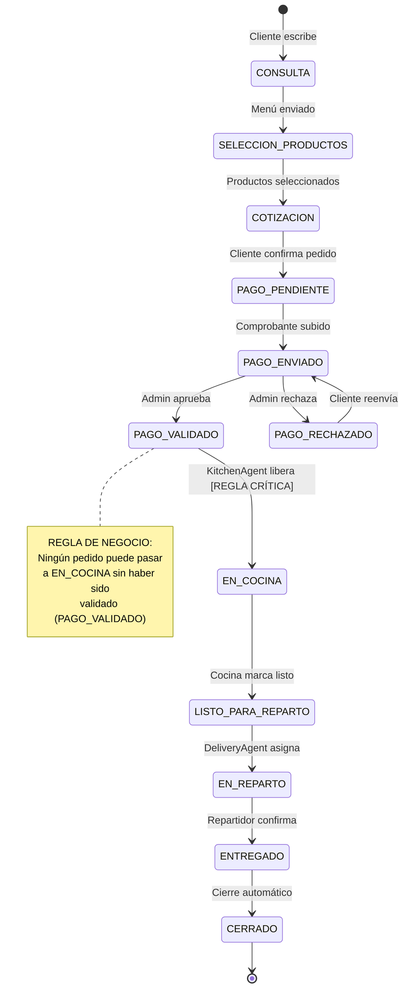

# Flujo del Pedido — Sistema TO-BE

## Diagrama de Flujo Principal

```mermaid
flowchart TD
    A([Cliente escribe al chatbot]) --> B[OrchestratorAgent\nrecibe mensaje]
    B --> C{Estado de sesión}

    C -->|GREETING| D[Solicitar nombre\nde cliente]
    D --> E[MenuAgent\nmuestra menú interactivo]
    E --> F[Cliente selecciona\nproductos]

    F --> G{¿Producto\nencontrado?}
    G -->|No| F
    G -->|Sí| H[OrderAgent\nagrega al carrito]
    H --> I{¿Confirmar\npedido?}
    I -->|No| F
    I -->|Sí| J[Capturar datos:\nteléfono, dirección,\nreferencia]

    J --> K[PricingAgent\ncalcula total]
    K --> L[Mostrar resumen\ncon total]
    L --> M{¿Cliente\nconfirma?}
    M -->|No| F
    M -->|Sí| N[OrderAgent\ncrea pedido en BD\nEstado: PAGO_PENDIENTE]

    N --> O[PaymentAgent\nenvía instrucciones\nYape/Plin]
    O --> P[Cliente realiza\nel pago]
    P --> Q[Cliente sube\ncomprobante]

    Q --> R[PaymentAgent\nguarda comprobante\nEstado: PAGO_ENVIADO]
    R --> S[AdminAgent\nrecibe alerta]
    S --> T{Admin valida\ncomprobante}

    T -->|Rechazado| U[PaymentAgent\nEstado: PAGO_RECHAZADO]
    U --> V[NotificationAgent\nnotifica cliente]
    V --> Q

    T -->|Aprobado| W[PaymentAgent\nEstado: PAGO_VALIDADO]
    W --> X[KitchenAgent\nREGLA: Solo acepta PAGO_VALIDADO]
    X --> Y[Estado: EN_COCINA]
    Y --> Z[NotificationAgent\nnotifica cocina]
    Z --> AA[Cocina prepara\nel pedido]

    AA --> AB[KitchenAgent\nmarca listo\nEstado: LISTO_PARA_REPARTO]
    AB --> AC[NotificationAgent\nnotifica cliente]
    AC --> AD[DeliveryAgent\nconsulta repartidores\ndisponibles]

    AD --> AE{¿Repartidor\ndisponible?}
    AE -->|No| AF[Esperar disponibilidad]
    AF --> AD
    AE -->|Sí| AG[DeliveryAgent\nasigna repartidor\nEstado: EN_REPARTO]

    AG --> AH[NotificationAgent\nnotifica cliente]
    AH --> AI[Repartidor\nentrega el pedido]
    AI --> AJ[DeliveryAgent\nconfirma entrega\nEstado: ENTREGADO]

    AJ --> AK[NotificationAgent\nnotifica cliente]
    AK --> AL[Estado: CERRADO]
    AL --> AM[Sistema envía\nencuesta de satisfacción]
    AM --> AN([Flujo completado])

    style X fill:#d32f2f,stroke:#b71c1c,color:#fff
    style T fill:#f57c00,stroke:#e65100,color:#fff
    style W fill:#2e7d32,stroke:#1b5e20,color:#fff
    style AN fill:#1565c0,stroke:#0d47a1,color:#fff
    style A fill:#1565c0,stroke:#0d47a1,color:#fff
```

## Diagrama de Estados del Pedido

## Tiempos Estimados del Flujo TO-BE

| Etapa | Tiempo estimado | Responsable |
|-------|----------------|-------------|
| Registro de pedido | 2-5 min | Cliente + Chatbot |
| Validación de pago | 1-3 min | AdminAgent |
| Preparación en cocina | 15-25 min | Cocina |
| Asignación de repartidor | < 1 min | DeliveryAgent |
| Tiempo de entrega | 15-30 min | Repartidor |
| **Total estimado** | **35-65 min** | Sistema completo |

**Comparación AS-IS vs TO-BE:**
- Tiempo de validación: 10-20 min → **1-3 min** (-85%)
- Errores de cálculo: Manuales → **0** (automatizado)
- Pérdida de pedidos: Frecuente → **0** (registro automático)
- Dependencia del encargado: Alta → **Mínima**
